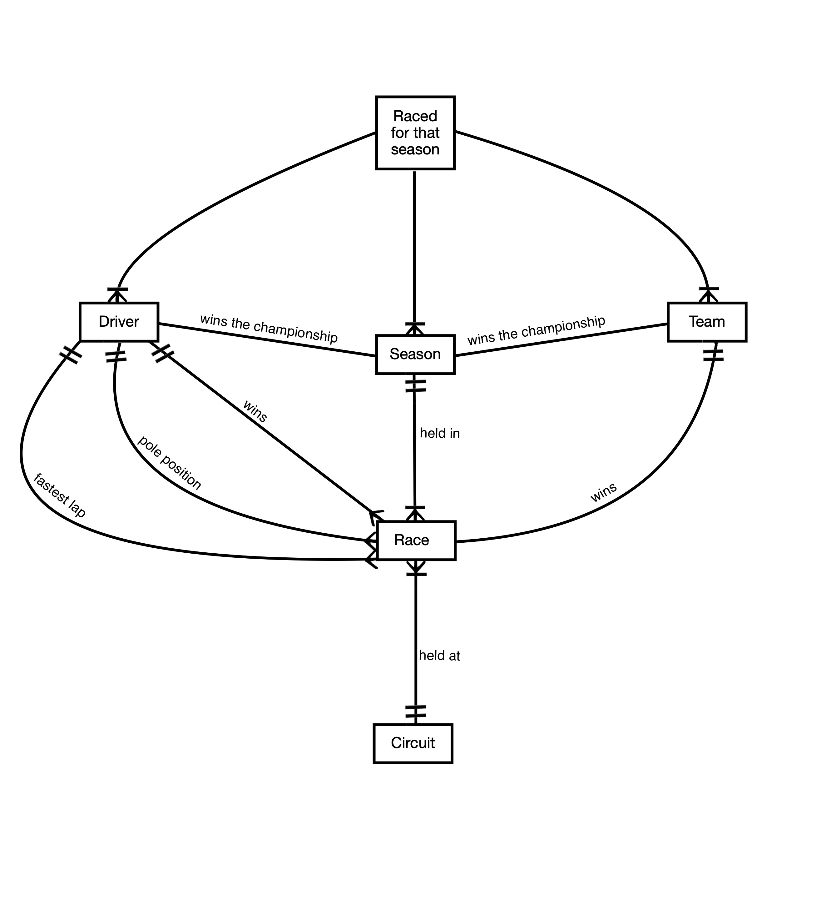

# Design Document

By Rahman Abbasli

Video overview: <https://www.youtube.com/watch?v=lNhTmYyC-XQ>

## Scope

The database includes all of the Formula 1 races, teams, drivers and other necessary elements to construct a query that can answer various questions.

* Drivers, teams, circuits and races are the scope of the database.

## Functional Requirements

This database will support:

* CRUD operations on Formula 1 races, drivers, teams and circuits.
* Tracking all of the Formula 1 races, figuring which team or driver has won how many races, fastest laps, pole positions.

## Representation

Entities are captured in SQLite tables with the following schema.

### Entities
The following entites are part of the schema:

#### Driver
`drivers` is a databases of
* `id` is `INTEGER` that specifies a unique id for each Formula 1 driver. This is also the `PRIMARY KEY`,
* `first_name` is a `TEXT` that is also `NOT NULL`, as the name of the column suggests, is the first name of the driver,
* `last_name` is the last name of the driver which is a `TEXT` and `NOT NULL`,
* `country` is also `TEXT` and `NOT NULL`, reflects the country of origin of the driver,
* `championships` is `INTEGER` that shows the FIA F1 Championships won by the driver. It is `NOT NULL` and `DEFAULT 0`,
* `wins` is `INTEGER` that shows the amount of individual races won by the driver. It is `NOT NULL` and `DEFAULT 0`,
* `pole_positions` is `INTEGER` that shows the amount of pole positions by the driver. It is `NOT NULL` and `DEFAULT 0`,
* `fastest_laps` is `INTEGER` that shows the amount of fastest laps by the driver. It is `NOT NULL` and `DEFAULT 0`,

#### Teams
`teams`
* `id` is `INTEGER` that specifies a unique id for each Formula 1 team. This is also the `PRIMARY KEY`,
* `name` is a `TEXT` that is also `NOT NULL`, is name of the team,
* `country` is also `TEXT` and `NOT NULL`, reflects the country of origin of the team,
* `championships` is `INTEGER` that shows the FIA F1 Championships won by the team. It is `NOT NULL` and `DEFAULT 0`,
* `wins` is `INTEGER` that shows the amount of individual races won by the team. It is `NOT NULL` and `DEFAULT 0`,

#### Seasons
 `seasons`
* `id` is `INTEGER` that specifies a unique id for the season. This is also the `PRIMARY KEY`,
* `year` is an `INTEGER`, that is also `NOT NULL`,
* `champion_driver_id` is the id of the driver who has won the championship that year, it is `NUMERIC` but not `NOT NULL`, as the championship might be ongoing. This is a `FOREIGN KEY` that references `id` from `drivers`.
* `champion_team_id` is the id of the team which has won the championship that year, it is `NUMERIC` but not `NOT NULL`, as the championship might be ongoing. This is a `FOREIGN KEY` that references `id` from `teams`.

#### Drivers' season was with which team
 `raced_for_that_season` is a junction table to create many to many relations
* `driver_id` is a `FOREIGN KEY` `INTEGER` that references `id` from `drivers`,
* `team_id` is a `FOREIGN KEY` `INTEGER` that references `id` from `teams`,
* `year_id` is a `FOREIGN KEY` `INTEGER` that references `id` from `seaons`.

 #### Circuits
 `circuits` is a table of Formula 1 circuits that has hosted an F1 race
* `id` is `INTEGER` that specifies a unique id for the circuit. This is also the `PRIMARY KEY`,
* `name` is `TEXT` and `NOT NULL` which is the name of the circuit,
* `country` is also `TEXT` and `NOT NULL`, reflects the country in which the circuit is located,
* `length` is `NUMERIC` and `NOT NULL`, showing the length of the circuit in metres.
* `turns` is `INTEGER` and `NOT NULL`, showing the number of turns in the circuit,
* `capacity` is `NUMERIC` which shows the attendance capacity of the circuit.

 #### Races
 `races`
* `year_id` is `NUMERIC` `FOREIGN KEY` that references `id` of the `seasons`,
* `circuit_id` is `NUMERIC` `FOREIGN KEY` that references `id` of the `circuits`,
* `winner_driver_id` is `NUMERIC` `FOREIGN KEY` that references `id` of the `drivers`,
* `winner_team_id` is `NUMERIC` `FOREIGN KEY` that references `id` of the `teams`,
* `pole_position_driver_id` is `NUMERIC` `FOREIGN KEY` that references `id` of the `drivers`,
* `fastest_laps_id` is `NUMERIC` `FOREIGN KEY` that references `id` of the `drivers`,

### Relationships

The below entity relationship diagram describes the relationships among the entities in the database.

As demonstrated on the graphic,

* Many-to-many relationship exists between drivers, teams and seasons. One driver may race in two teams in a season, he can race in the same team several seasons and one team may have more than one driver given the season.

* Race can only be won one and only one driver and one and only one team, it will also will have one and only one fastest lap setter, and one and only one pole position taker. A race can also be associated with only one circuit and only one season.

* Season is having one and only driver that wins it, and one and only team that wins it.

## Optimizations
Indices have been created on `drivers`'s `first_name` and `last_name`, as well as `teams`'s `name`.

## Limitations

The current schema only considers race winner teams, and race winner, pole position taker and fastest lap setter drivers. It can be further improved by including the rest of the Formula 1 grid.
